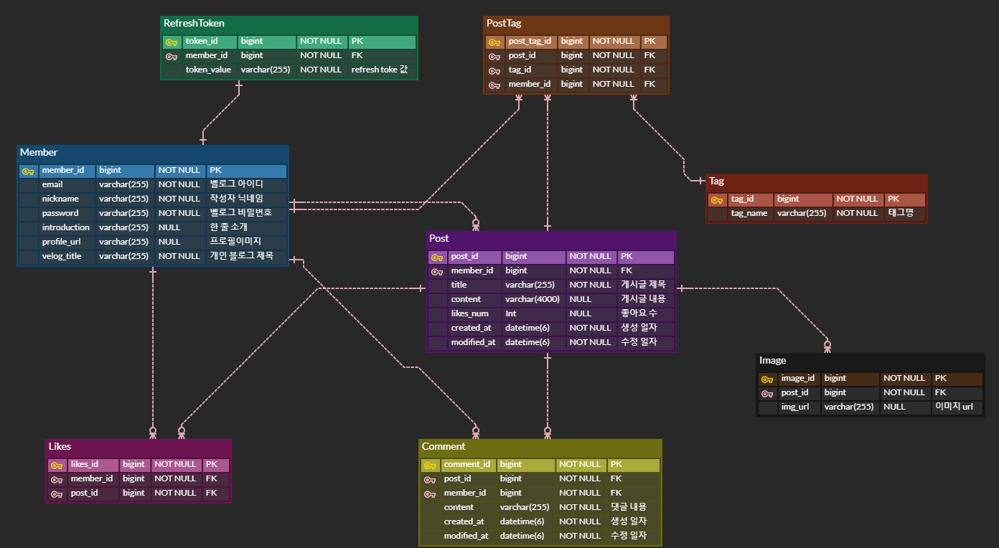

# [Clone-Coding] velog

## 👋 프로젝트 소개

<b> velog 클론코딩 프로젝트입니다. </b>

 

## 👩🏻‍💻 Contributors 🧑🏻‍💻

| [박세은](https://github.com/marksenee)        | [김기연](https://github.com/kky7)           | [김진이](https://github.com/kimjini97) | [오정진](https://github.com/OhJungJin) | [최준묵](https://github.com/dan-studio)  |
| --------------------------------------------- | ------------------------------------------- | -------------------------------------- | -------------------------------------- | ---------------------------------------- |
| 로그인 / 회원가입 / 좋아요 / 검색 / 태그 기능 | 로그인 / 회원가입 / 게시글 CRUD / 태그 기능 | 댓글 CRUD / 이미지 첨부 / 좋아요 / 검색 / 마이 페이지 기능   | 댓글 CRUD / 무한스크롤 기능            | 게시글 CRUD / 마크다운 / 공유 기능   |
| Front-end                                     | Back-end                                    | Back-end                               | Front-end                              | Front-end                                |

 

## ⚙️ Tech Stack 🛠

  

## [API Link](https://screeching-crater-139.notion.site/Velog-Clone-Coding-API-1282207c279043eeb338100ae815bc64)

  

## 🤟🏻 주요 기능

 

### `로그인 / 회원가입`

- 로그인 기능
- 회원가입 기능
- 로그아웃 기능
- 로그인 연장 기능

### `메인 페이지`

- 게시글 전체 조회하기

### `게시글 CRUD`

- 전체 게시글 조회하기
- 특정 게시글 조회하기
- [마크다운] 게시글 등록하기
- [마크다운] 게시글 수정하기
- 게시글 삭제하기
- 이미지 첨부 기능

### `댓글 CRUD`

- 댓글 조회
- 댓글 등록
- 댓글 수정
- 댓글 삭제

### `좋아요 기능`

- [게시글] 좋아요 개수 조회
- [특정 게시글] 좋아요 기능 구현

### `검색 기능`

- 입력값에 따라 게시글 검색
- 검색 결과에 따라 필터링된 게시글 조회

### `태그 기능`
- 개인 블로그 태그에 따라 게시글 조회

### `내 벨로그`

- [내 벨로그] 사용자가 쓴 게시글 조회
- [내 벨로그] 태그에 따라 특정 게시글 조회
- [내 벨로그] 내가 좋아요한 게시글 조회

  

## 🤟🏻 ERD

  